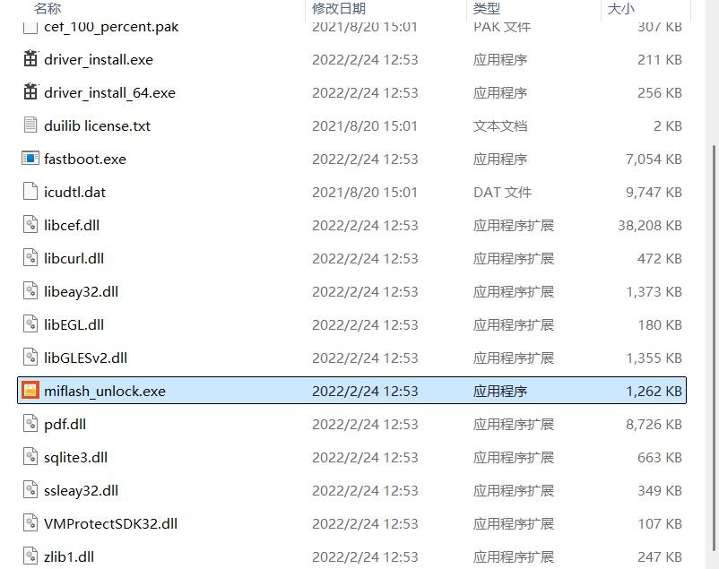

## 在这之前

因为本人实在是闲得慌，于是心血来潮，决定给自己的红米平板刷个root玩:D

网上刷机都是旧版的教程，所以对于新系统会失效，这里是查阅了很多资料得出的新方法（适用于安卓高版本）

## 准备工作

- 1 Redmi Pad SE （代号：xun）（小米澎湃OS）

- 2 Windows 计算机

- 3 usb数据线

- 4 已绑定设备 >= 7天的小米账号

- 5 狐狸面具安装包

- 6 adb驱动

- 7 Redmi Pad SE 线刷包（系统镜像文件）

> 除了PAD其它的下载链接我都放在了文章末尾
>
> 资源来自互联网，本人不负责刷机后的设备安全

## 解锁设备 Bootloader
### A 小米社区考试

优势：官方认证

劣势：需要小米社区Lv5，并且参加社区考试，对学生党不是很友好

在这里就不详细介绍了，相信你都来看这篇了应该不会想要麻烦:D

### B 使用第三方强制获取解锁权限
首先来到pad：

打开pad设置>我的设备>全部参数与信息

连续快速点击“OS版本”项，直到看见提示“您已处于开发者模式”

然后点击更多设置>开发者选项>USB调试，将USB调试相关项全部启用。

现在回到电脑：

在下载的文件夹点击“绕社区工具”

打开文件夹后运行“手机驱动（安卓通用）.exe”，安卓过程自行下一步

接着运行“解锁.exe”

运行结束后返回上级页面，
打开“miflash_unlock-6.5.224.28”文件夹

运行“miflash_unlock.exe”

重启后不出意外应该解锁成功。

## 安装狐狸面具

前往[GitHub](https://github.com/1q23lyc45/KitsuneMagisk/releases)下载最新版本的面具安装包，一般下载qpp-release.apk
> 后续我把此安装包也放在了末尾链接里，打不开github的用户可以去那里下载，但可能不是最新版本

在pad上安装，报警忽视，软件是免费开源的，无毒无害:D

安装好开始root

- 1 手机插电脑文件传输模式复制 系统固件 > init_boot.img 进手机 Download 目录

- 2 打开狐狸面具，安装 > 选择 init_boot.img > 开始修补文件 > 修补完成，修补生成的文件 magisk_patched-xxx.img 在 Download 目录
 

- 3 打开“adb-fastboot”文件夹

- 4 运行“打开CMD命令行”

- 5 进入 Fastboot 模式，手机关机，电源键 + 音量下键，两个键长按，在刚才打开的终端输入

    <code>adb reboot fastboot</code>

- 6 确认进入fastboot/fastbootd模式后，在刚才的终端输入

    <code>fastboot flash init_boot magisk_patched-xxx.img（这里是你刚刚修补的文件，输入magisk后按“Tab"可以自动补全</code>

- 7 如图则成功

>### 可能会遇到的问题
>
>- 1: partition does not exist
>
>如果刷入提示这个，执行下面这个指令进入 fastbootd 模式，再重新刷入即可
>
><code>fastboot reboot fastboot</code>
>
>- 2: waiting for any device
>
>如果刷入提示这个，有以下几种情况
>
>- 1 USB3.0 接口
>
>    - 换个 USB2.0 接口（一般 USB 接口是黑色的）还不行就换台式机（一般都有 USB2.0）
>
>- 2 数据线问题
>
>    - 1、重新插拔，换个 USB 接口
>
>    - 2、一些便宜的线会阉割数据传输，只保留充电功能。建议更换数据线，最好原装线。
>
>- 3电脑没有安装驱动
>
>    - 1、打开 MiFlash2018-5-28-0
>    
>
>    - 2、运行 XiaoMiFlash.exe > Driver > 安装
>   

- 8 开机有震动基本没问题了，耐心等开机。（显示了版本，就是刷好了的）

## 温馨提示
如果刷入 magisk_patched-xxx.img 不能开机，可以把前面提取的 init_boot.img 通过 fastboot 刷回去，恢复原版 init_boot，一般都能正常开机

init_boot.img 保留一份在电脑，避免出问题了可以自救下.

还原 init_boot 指令

<code>fastboot flash init_boot init_boot.img</code>

## 资源下载

Gitee：https://gitee.com/THZtx/download/releases/tag/20250813-1

> 部分图片来自网络，侵权请联系删除