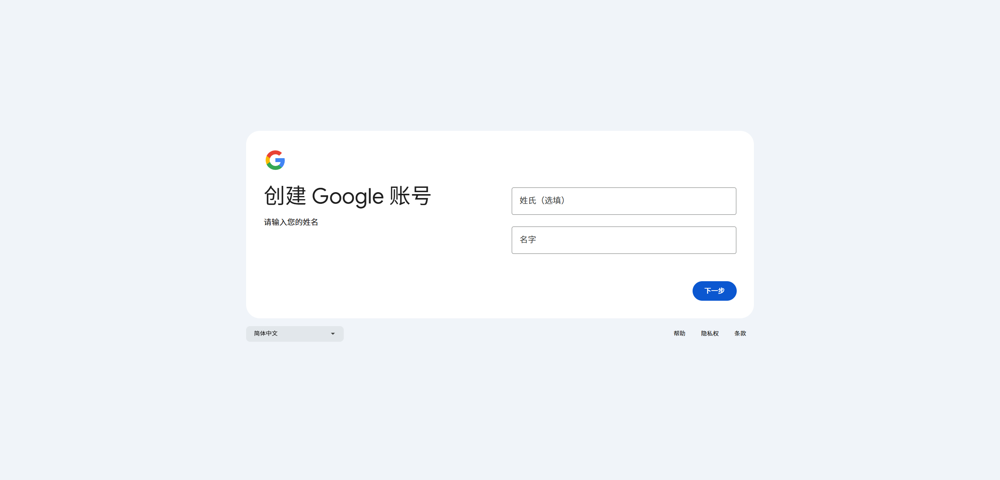
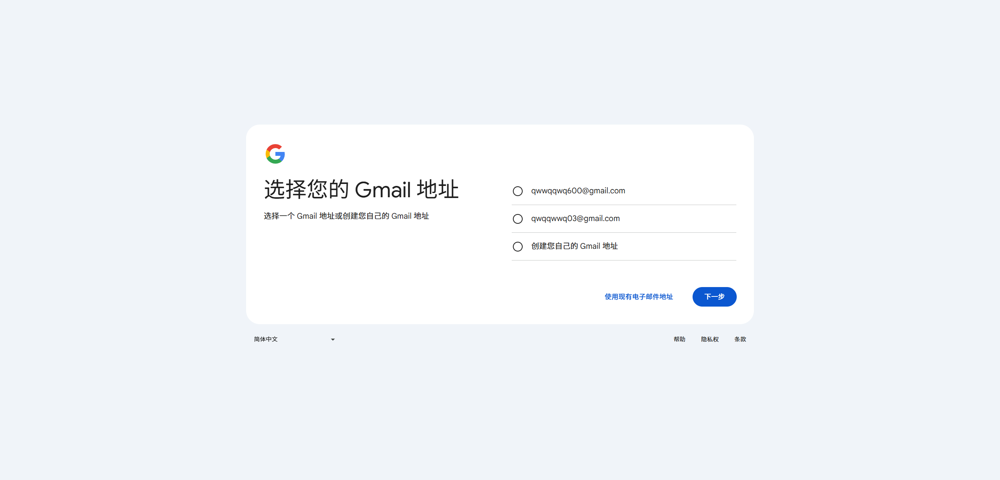

## 准备
- 一台可以正常上网的设备
- 霍格沃兹网络环境
- 健全的双手

## 网络
怕被封不说了。

## 注册Google账号
> 确保你已打开魔法环境

打开 [Google](https://accounts.google.com/signup)

按提示下一步

到这里按你个人需要选

后面如果需要输入手机号可以更换电脑尝试

刚刚你选择的、设置的邮箱就是你的谷歌邮箱

## 怎么用呢？
下载一个邮箱软件（如网易邮箱大师

打开魔法环境

添加你刚刚的邮箱并输入你设置的密码就可以收发邮件了

也可以到[GMAIL官网](https://mail.google.com/)登录